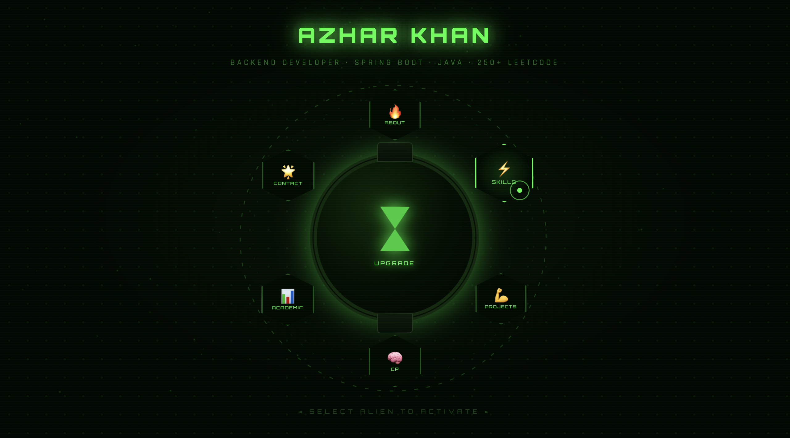

# 🟢 Azhar Khan — Omnitrix Portfolio

> ⚡ A futuristic, interactive developer portfolio inspired by the Omnitrix (Ben 10)

---

## 📸 Preview



---

## 🚀 Live Demo
https://azharkhan924.github.io/Omnitrix-Portfolio/

---

## 🧠 Concept

This portfolio is designed as an **interactive Omnitrix interface**, where:

* Each section is represented as an **Alien**
* Users "transform" into sections using animated transitions
* Entire navigation works like a **Single Page Application (SPA)**

---

## ⚙️ Tech Stack

### 💻 Frontend

* HTML5
* CSS3 (Advanced animations, clip-path, glass UI)
* Vanilla JavaScript

### 🎨 UI/UX Features

* Custom animated cursor
* Particle background (Canvas API)
* 3D parallax effects
* Omnitrix-style transformation animation
* Sound effects integration

---

## 🧩 Features

### 🟢 Interactive Omnitrix UI

* Circular watch interface
* 6 alien-based navigation buttons
* Hover-based alien preview

### 🎬 Transformation Animation

* “IT’S HERO TIME” animation
* Screen transition system

### 🧠 Dynamic Content System

* Sections rendered dynamically using JavaScript
* SPA-like behavior (no page reload)

### 📊 Skills Visualization

* Animated progress bars
* Categorized technical skills

### 🌌 Advanced Effects

* Particle system using Canvas
* Glow effects & scanlines
* Rotating SVG rings

---

## 📂 Project Structure

```
Omnitrix-Portfolio/
│
├── index.html
├── assets/
│   ├── screenshot.png
│   ├── hover.mp3
│   ├── transform.mp3
│   └── deactivate.mp3
└── README.md
```

---

## 🛠️ How to Run Locally

1. Clone the repository

```bash
git clone https://github.com/your-username/your-repo-name.git
```

2. Open the project

```bash
cd your-repo-name
```

3. Run in browser

* Simply open `index.html`

---

## 🎯 Key Highlights

✔ Custom-built SPA using Vanilla JS
✔ Advanced CSS animations & UI design
✔ Game-like interactive experience
✔ Clean component-like architecture
✔ Creative storytelling through UI

---

## 📌 Future Improvements

* Convert to React.js architecture
* Add backend (Spring Boot) for dynamic data
* Integrate GitHub API for live projects
* Add mobile optimization enhancements

---

## 👨‍💻 Author

**Azhar Khan**
📍 Indore, Madhya Pradesh, India

* 📧 [azharkhan230826@acropolis.in](mailto:azharkhan230826@acropolis.in)
* 📱 +91 7067289757

---

## ⭐ Support

If you like this project, consider giving it a ⭐ on GitHub!

---

## ⚡ Inspiration

Inspired by the **Omnitrix (Ben 10)** — reimagined as a developer portfolio.

---
